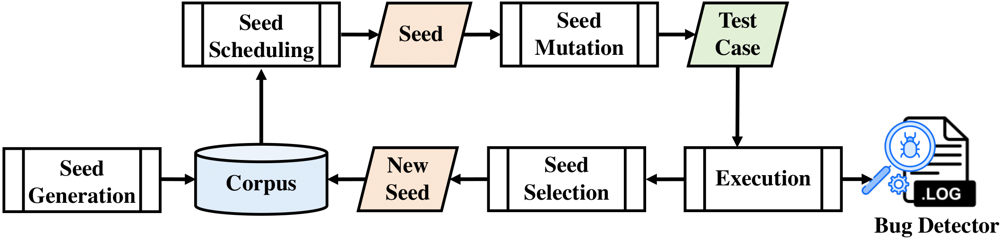
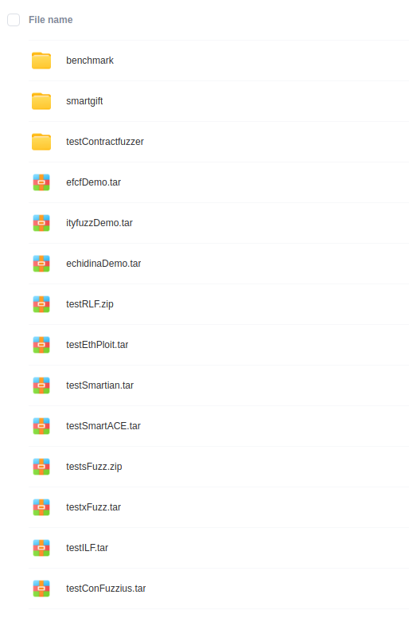

# Are We There Yet? Unraveling the State-of-the-ArtSmart Contract Fuzzers (Experience Paper)

<p align="center"></p>

# Questionnaire
To see the **Questionnaire** used in this paper, please open `index.html`, or you can visit this url: 

http://htmlpreview.github.io/?https://github.com/SE2023Test/SCFuzzers/blob/main/index.html


# Artifacts
<table><tr><td bgcolor=orange> Due to the size limit of 2GB imposed by Git LFS and GitHub, all the dockerfiles and benchmarks used in our experiment are available for access at: https://terabox.com/s/1NcZk3SUi6uEWjnZRo7Qw9A</td></tr></table>  

<p align="center"></p>


https://terabox.com/s/1NcZk3SUi6uEWjnZRo7Qw9A


Get started
===========
### How to load each Dockerfile:

1 import the docker image
```
docker import xxxxxDemo.tar testimage
```
2. start docker image
```
docker run -idt -p 5180:80 testimage:latest /bin/bash
```
3. run docker image
```
docker exec -it container_ID_obatined_in_step_2  /bin/bash
```
Please note that, due to the size of files, for some docker file, we upload a compressed one, please unzip it before you check. 


### Segmented compression

For particularly large files, we have used segmented compression, so please merge the segments before using them.
For example, to merge the files under `testContractfuzzer` folder

```
zip contractfuzzer.zip .z01 -s=0 --out testContractfuzzer.zip
```
After that, use the unzip command to unzip


Usage
=====

### 1.ContractFuzzer
#### How to run
```
docker run ......
cd /ContractFuzzer
bash run.sh --contracts_dir contract_folder
```
The covered instructions can be found at file: `/tracelog.log`, 
the output result can be found at `contract_folder`.

#### Source code
[LINK](https://github.com/gongbell/ContractFuzzer).

****

### 2.ILF
#### How to run
```
cd /go/src/ilf
bash ilfTestDepth.sh
```
The log file can be found at `/go/src/ilf/log/`

#### Source code
[LINK](https://github.com/eth-sri/ilf).

****

### 3.ConFuzzius
#### How to run
```
cd /root
python3 test.py
or python3 test_depth.py
```
the output result can be found at `./log/`.

#### Source code
[LINK](https://github.com/christoftorres/ConFuzzius).

****

### 4.sFuzz
#### How to run
```
cd /workdir
bash mainShell.sh
```
the output result can be found at `./output/`

#### Source code

[LINK](https://github.com/duytai/sFuzz).

****

### 5.xFuzz
#### How to run
```
cd /workdir
bash main.sh
```
the output result can be found at `./output/`

#### Source code
[LINK](https://github.com/zhang-alt/xFuzz).


****

### 6.RLF
#### How to run
```
docker run ......
cd /go/src/rlf/
bash ilfTest.sh
```
the output result can be found at `./log/`

#### Source code
[LINK]().

****

### 7.Smartian
#### How to run
```
cd /Smartian
bash mainshelldepth2.sh
```
the output result can be found at `./test/`

#### Source code
[LINK](https://github.com/SoftSec-KAIST/Smartian).

****

## 8.SmartGift
#### How to run
```
cd /SmartGift/code
python3 SmartGift_main.py target_abi_path sample_path output_path
cd /SmartGift/ContractFuzzer/
bash run.sh --contracts_dir contract_folder output_path
```
The covered instructions can be found at file: `/tracelog.log`, 
the output result can be found at `contract_folder`.

#### Source code
[LINK](https://github.com/chaoweilanmaohahaha/SmartGift).

****


### 9.EthPloit
#### How to run
```
cd /contract-fuzzer/src
bash maindepth2.sh
```
the output result can be found at `./output/`

#### Source code
[LINK](https://github.com/zqzqz/contract-fuzzer).


****

### 10.ityfuzz
#### How to run
```
cd /ityfuzz
bash ityfuzz.sh
```

the output result can be found at `/ityfuzz/result/`

#### Source code
[LINK][https://github.com/fuzzland/ityfuzz]

****

### 11. efcf

#### How to run
```
cd /efcf
bash efcf.sh
```
the output result can be found at `/efcf/result/`

#### Source code
[LINK](https://github.com/uni-due-syssec/efcf-framework)

------------------------------------

#### SmartACE (not used in our experiment)
#### How to run

```
cd /smartace
solc contract_file --bundle=contract_name --concrete --reps=5 --c-model \
    --output-dir=fuzz

cd fuzz ; mkdir build ; cd build
CC=clang-10 CXX=clang++-10 cmake ..
cmake --build . --target fuzz
```

#### Source code
[LINK](https://github.com/contract-ace/smartace/blob/cmodel-dev/tutorials/2_getting_started.md).


